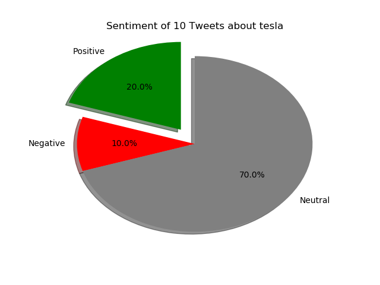

# Twitter-Sentiment-Analysis
This project is a Twitter Sentiment Analyser that takes in a subject for it's query and the number of tweets and provides a pie chart based on the responses. It is based on the Aylien API and is built on Python. 

1. For the code to work, you need the following libraries:
 1.1 tweepy (to gather Tweets)
 1.2 aylien-apiclient (to analyze the sentiment of the Tweets)
 1.3 matplotlib (to visualize the results)

2. Get the API keys from Twitter and Aylien.
3. Copy and paste the code, fill in your keys and you are good to go!

Sample Output: 

